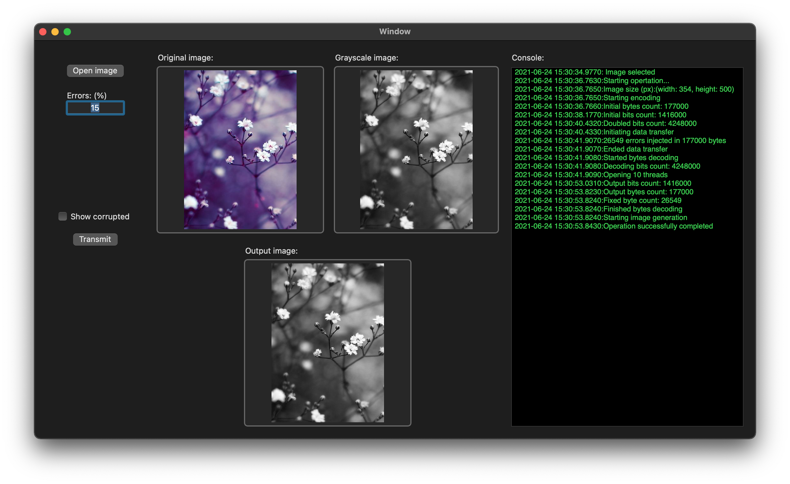

# ImageErrorDetection
Работа над этим проектом велась в рамках курсовой работы 1 курса программы "ИВТ", МИЭМ  НИУ ВШЭ. (2018-2019)

Данный проект наглядно демонстрирует процесс коррекции ошибок, который обычно возникает при передачи данных. 
Пользователь может выбрать изображение и запустить процесс внедрения ошибок, указав количество в процентах(от размера изображения), а затем коррекции (методом с повторением). 
На выходе получится уже исправленное изображение на которое можно наложить маску, чтобы увидеть пиксели, в которых были обнаруженны ошибки.

.png)
